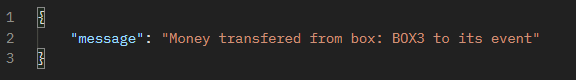

# Collection box application
#### Collection boxes management app for Fundraising Events
## How to build and run:
```bash
mvn spring-boot:run
```

## Available API Endpoints:
### Base URL:
http://localhost:8080/v1/

| Method   | Endpoint                                  | Description                                             |
|----------|-------------------------------------------|---------------------------------------------------------|
| `POST`   | `/v1/event`                               | Create new Fundraising Event                            |
| `POST`   | `/v1/collection-box`                      | Register new Collection Box                             |
| `GET`    | `/v1/collection-box/boxlist`              | Get list of Collection Boxes                            |
| `DELETE` | `/v1/collection-box/{box}`                | Deletes the Collection Box                              | 
| `PUT`    | `/v1/collection-box/assign/{box}/{event}` | Assign the box to the Fundraising Event                 |
| `PUT`    | `/v1/collection-box/addfunds`             | Put money in the Collection Box                         |
| `PUT`    | `/v1/collection-box/transfer/{box}`       | Transfer money from Collection Box to Fundraising Event |
| `GET`    | `/v1/event/report`                        | Get a report of Fundraising Events                      |


## Example:
#### Endpoint `POST`: http://localhost:8080/v1/event
#### Request Body:
```json
{
    "name":"Event1",
    "currency":"EUR"
}
```
#### Output:


#### Endpoint `POST`: http://localhost:8080/v1/collection-box
#### Request Body:
```json
{
    "uid":"BOX1"
}
```
#### Output:


#### Endpoint `GET`: http://localhost:8080/v1/collection-box/boxlist
#### Output:


#### Endpoint `DELETE`: http://localhost:8080/v1/collection-box/BOX1
#### Output:


#### Endpoint `PUT`: http://localhost:8080/v1/collection-box/assign/BOX3/Event1
#### Output:


#### Endpoint `PUT`: http://localhost:8080/v1/collection-box/addfunds
#### Request Body:
```json

{
    "currency":"PLN",
    "amount":"120",
    "boxUid":"BOX3"
}
```
#### Output:


#### Endpoint `PUT`: http://localhost:8080/v1/collection-box/transfer/BOX3
#### Output:

#### Endpoint `GET`: http://localhost:8080/v1/event/report
#### Output:
